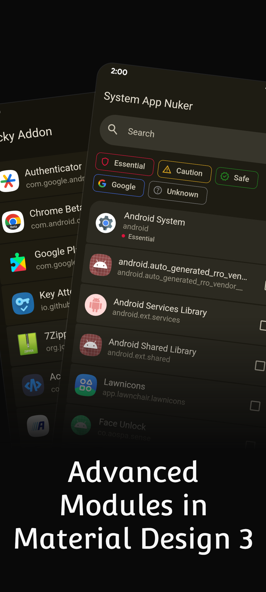
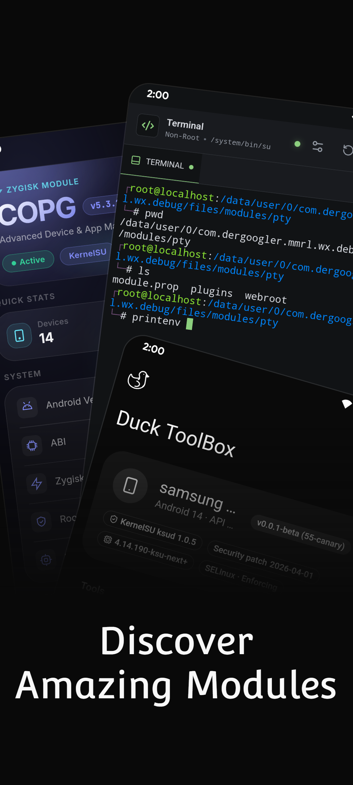
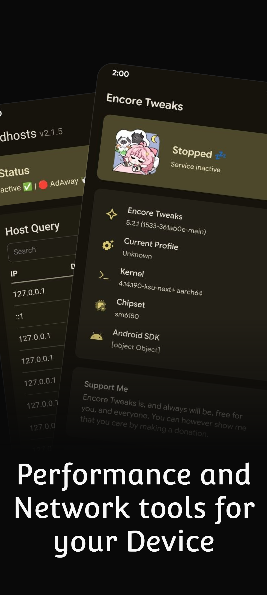
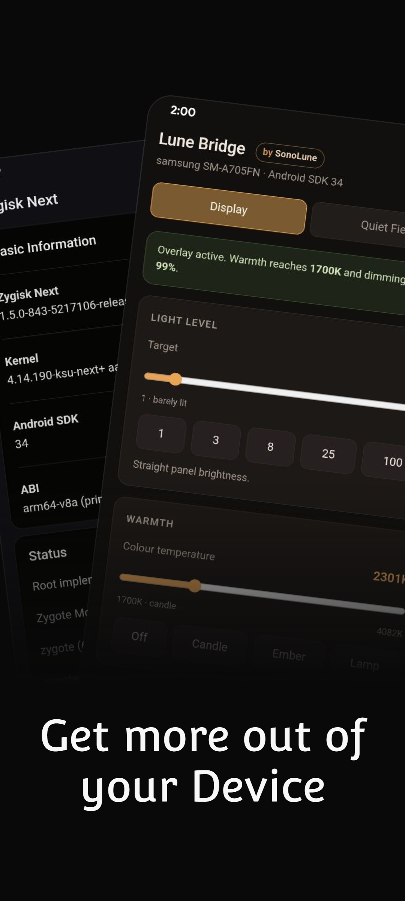
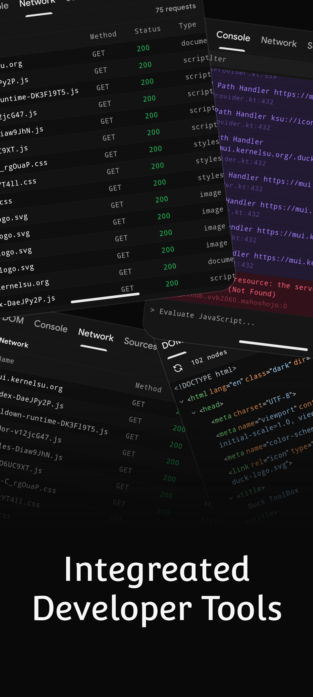

# WebUI X: Portable

WebUI X: Portable (WXP) is an advanced WebUI runtime host and developer environment for Android web interfaces. It allows you to run, inspect, and debug module WebUIs across root and non-root setups with powerful built-in developer tooling.

---

## Previews

  
  
  
  
  

---

## Core Features

- **Universal Environment Support:** Runs on KernelSU, Magisk, APatch, and non-root ADB environments.
- **Native MX Engine:** High-performance WebUI runtime with automatic inset padding and custom theme handling.
- **Full DevTools Suite:** Built-in DOM inspector, network monitoring, console history, and snippet execution.
- **Extensible Architecture:** Supports Dex and Lua plugins, custom JS interfaces, and extended KernelSU I/O APIs.
- **File Explorer & Editor:** Integrated File Explorer with a TextMate-powered code editor for real-time script modifications.
- **System Diagnostics:** Dashboard providing device information, system status, and module metrics.

---

## Translate

Get involved with WebUI X: Portable by translating it into your language!

